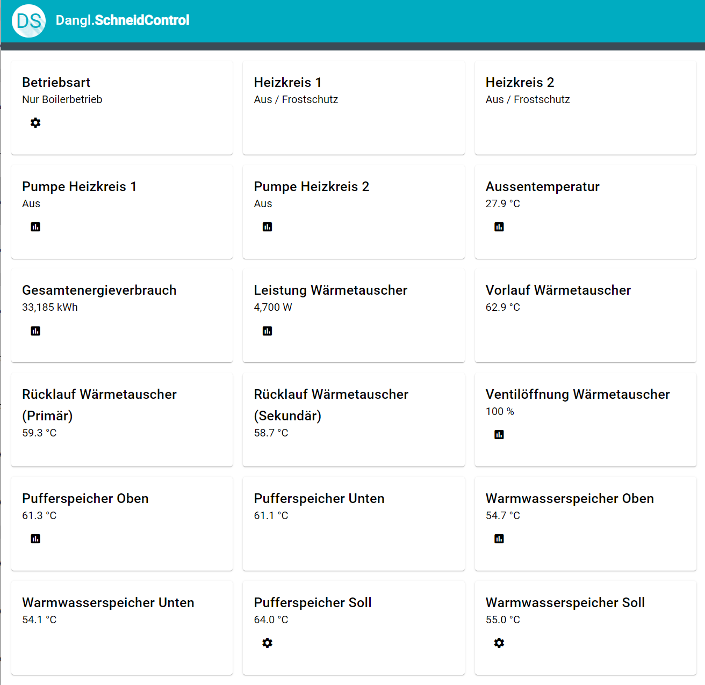
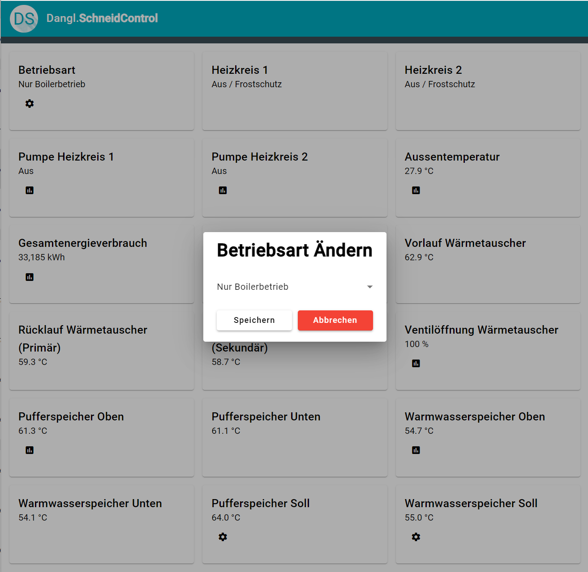
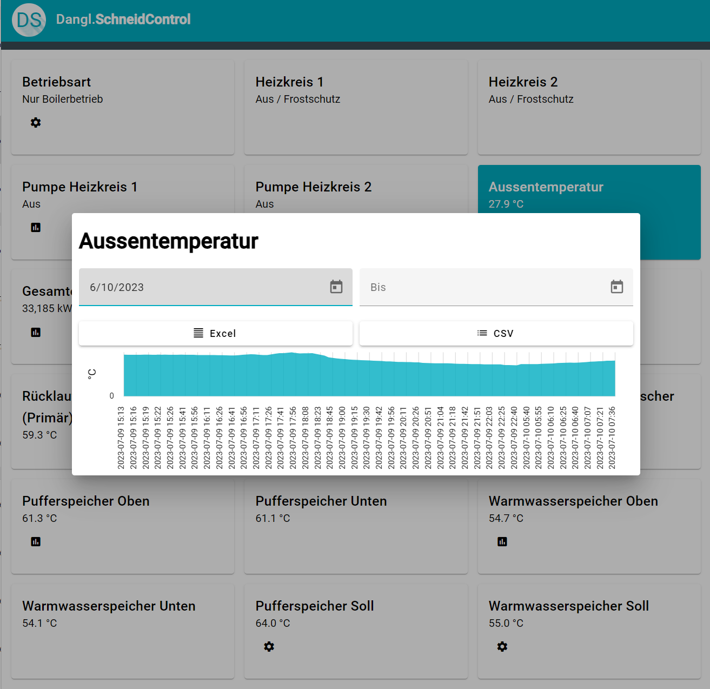

# Dangl.SchneidControl

This is an app that allows you to visualize and control a Schneid MR12 district heating controller. It connects via ModBus TCP to the unit and optionally allows data logging.

It's available on DockerHub: <https://hub.docker.com/r/dangl/dangl-schneid-control>

## Configuration

To run the Docker container, you need to specify these environment variables:

| Name                      | Required | Description                                                                                           |
| ------------------------- | -------- | ----------------------------------------------------------------------------------------------------- |
| `SchneidModbusIpAddress`  | Yes      | The IP address of the Schneid controller.                                                             |
| `SchneidModbusTcpPort`    | Yes      | The port of the Schneid controller.                                                                   |
| `DatabaseLoggingFilePath` | No       | An optional file path for data logging. An SQLite database will be created and managed automatically. |

If no value for `DatabaseLoggingFilePath` is given, then no data will be logged.

## Features

### Data Visualization

### Control

### Data Logging & Export

Log data can optionally be exported to Excel or CSV.
